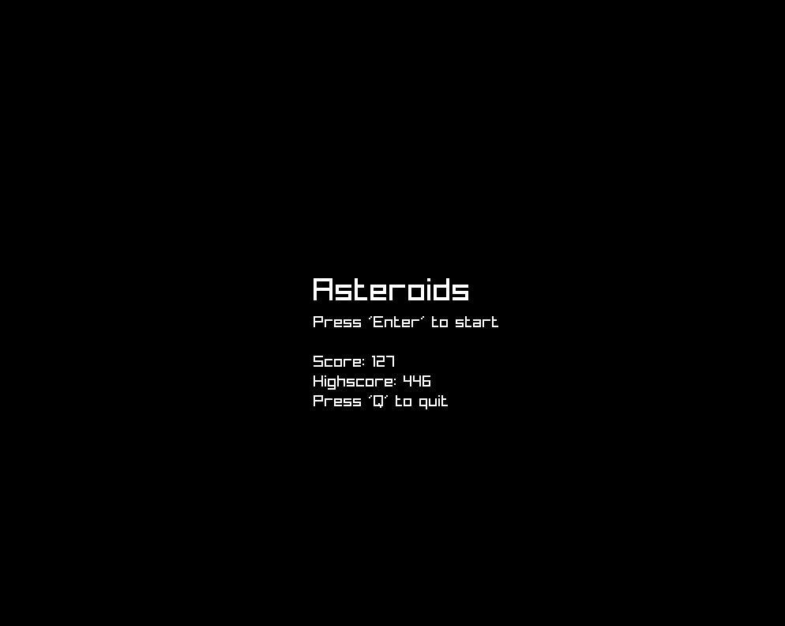
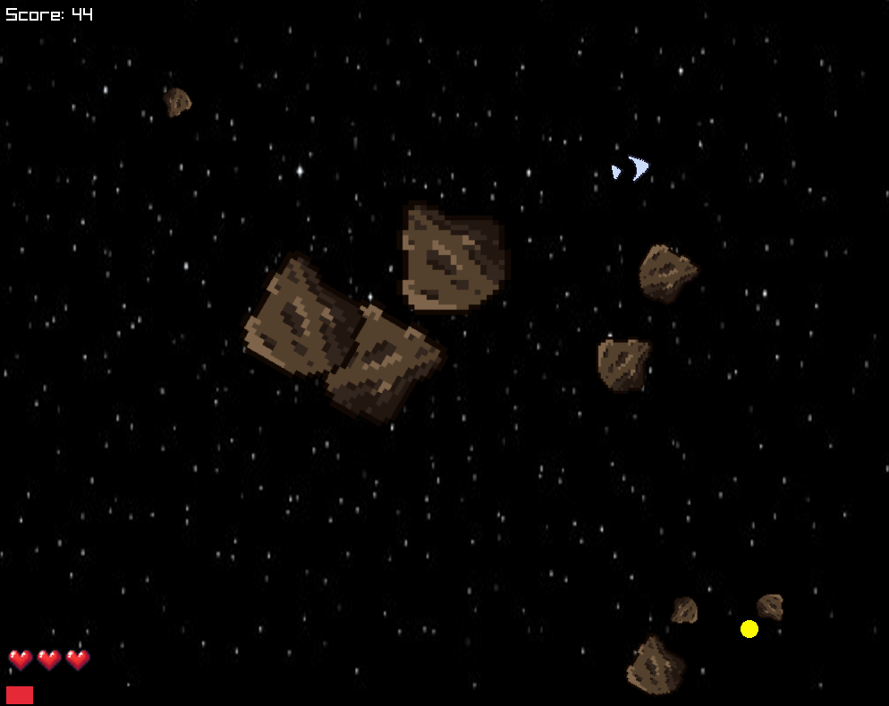

# Asteroids

A simple game of asteroids made with go and raylib.

- [Description](#description)
- [Installation](#installation)
- [Controls](#controls)
- [Todos](#todos)

## Description
The game is a simple take on the classic asteroids game. The player controls a spaceship and has to destroy asteroids to gain points. The game is over when the player runs out of lifes. The game also features powerups that can help the player destroy asteroids faster. The game is made with go and raylib. 
I also added some features like a highscore system and reloading your weapons after a certain amount of bullets are shot.



## Installation
- clone the repository
```bash
$ git clone https://github.com/Pazl27/Asteroids.git
```
- make sure you have go installed
```bash
$ go --verions
```
- run the game with go
```bash
$ go run cmd/main.go
```
- this step can take a while, as go will download all the dependencies


## Controls 
- `W` to move forward
- `A` to rotate left
- `D` to rotate right
- `S` to stop
- `Space` to shoot

## Todos
- [x] spawn new asteroids when one is destroyed
- [ ] add music
- [ ] add sound effects
- [x] highscore system
- [x] powerups
- [x] reload system
- [ ] boss fights? 
- [ ] new enemy types
- [ ] more powerups (destroy on inpact)
- [x] asteroid sprites
- [x] background image 
- [x] add lifes
- [ ] waves of asteroids (level)

