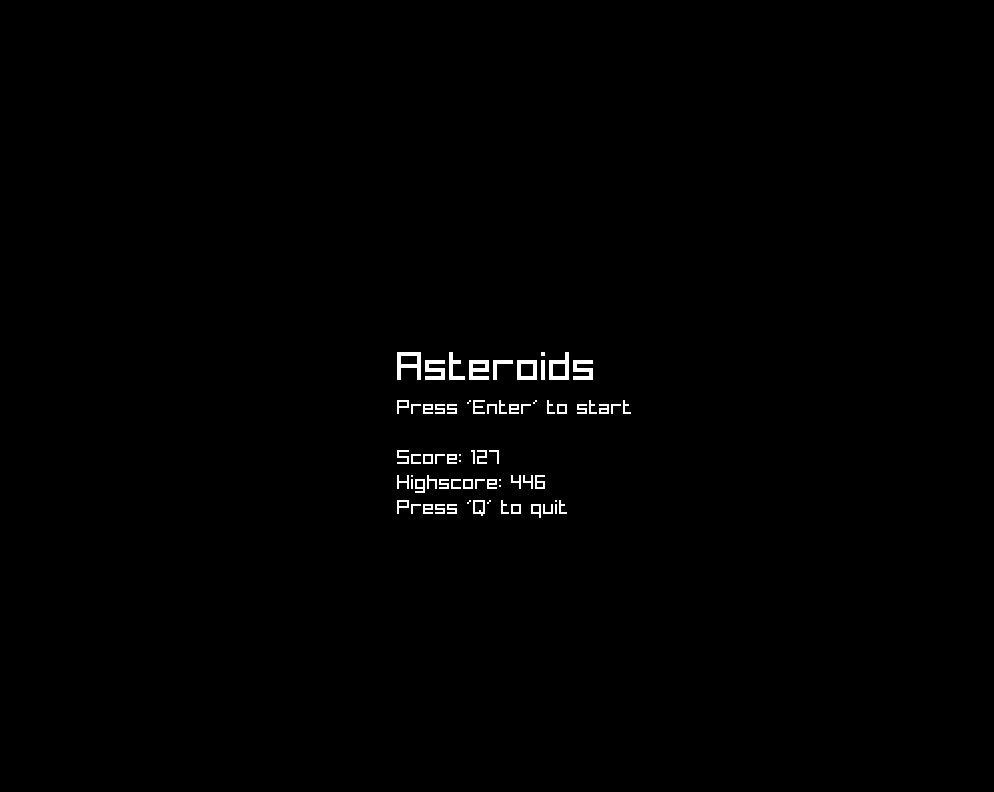
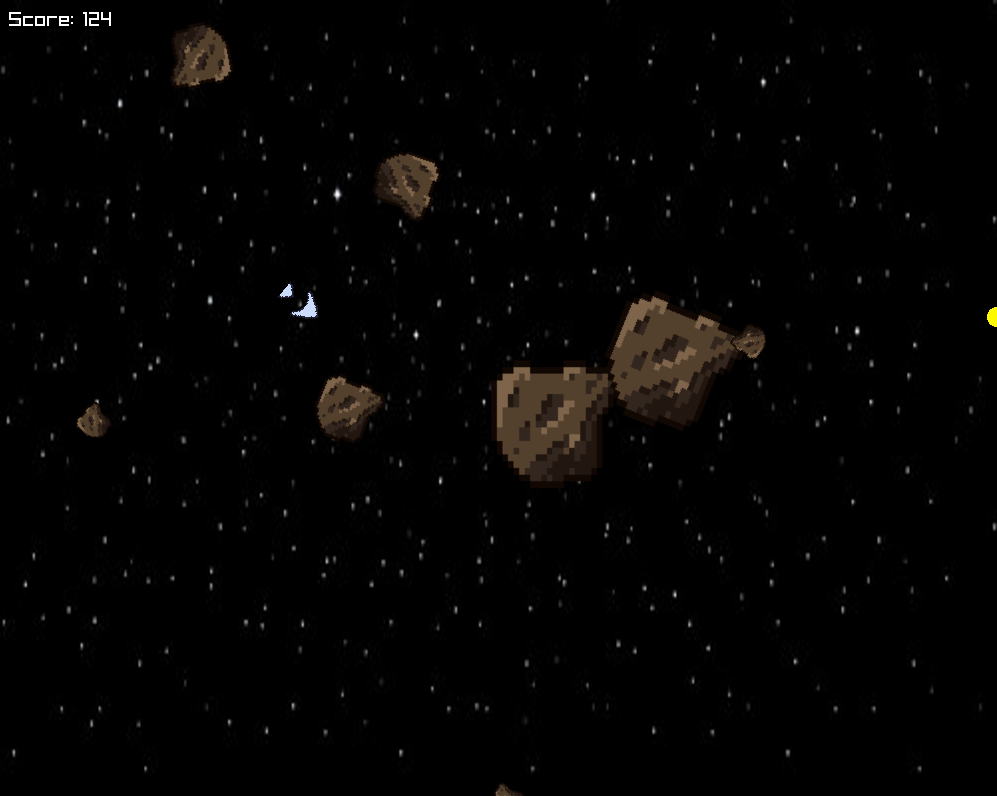

# Asteroids

A simple game of asteroids made with go and raylib.

- [Description](#description)
- [Installation](#installation)
- [Controls](#controls)
- [Todos](#todos)

## Description



## Installation
- clone the repository
```bash
$ git clone https://github.com/Pazl27/Asteroids.git
```
- make sure you have go installed
```bash
$ go --verions
```
- run the game with go
```bash
$ go run cmd/main.go
```
- this step can take a while, as go will download all the dependencies


## Controls 
- `W` to move forward
- `A` to rotate left
- `D` to rotate right
- `S` to stop
- `Space` to shoot

## Todos
- [x] spawn new asteroids when one is destroyed
- [ ] add music
- [ ] add sound effects
- [x] highscore system
- [x] powerups
- [x] asteroid sprites
- [x] background image 
- [ ] add lives

